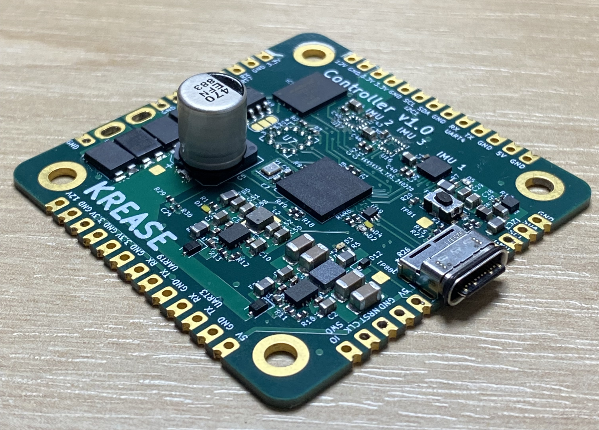

# CuttleBot and FOLD Actuator Electronics Design
This repository contains the electronics design files and firmware for the CuttleBot, a biomimetic underwater robot, and its FOLD actuators. The system architecture is designed for efficient control and feedback, providing precise manipulation of the actuators for underwater mobility.

A follow up work from [Fin ray-inspired, Origami, Small Scale Actuator for Fin Manipulation in Aquatic Bioinspired Robots](https://arxiv.org/abs/2407.16821)

---

## System Overview

The CuttleBot's electronic system is divided into two key components:
1. **Main Controller**
2. **Driver and Actuator Modules (8 units)**


---

## Components

### Main Controller (Current version: v1.1)



- **Microcontroller**: STM32H743VHX
- **Connected Sensors**:
  - **IMU**: Three sensors (ASM330LHHXG1, ICM20602, ICM20602) are connected over SPI to provide Attitude and Heading Reference System (AHRS) data for underwater navigation.
  - **Pressure Sensor**: MPRLS0025PA 00001A, used to determine depth.
  - **Flash Memory**: W25Q256/VEIQ TR, for data storage.

The main controller (STM32H743VHX) processes data from the IMUs and the pressure sensor to calculate the robot's position and orientation. It then broadcasts the actuator position setpoints over I2C to each of the driver modules.

### Driver Module (8 units)


Each FOLD actuator has its own dedicated driver module, responsible for controlling the actuator's motion and maintaining position feedback. The driver module is built around the following components:

- **Microcontroller**: STM32F031G6U6
  - Stores lookup tables for position control and uses feedback from the Hall sensor to control actuator position.
  
- **Hall Sensor**: DRV5055
  - Provides position feedback to the driver, enabling precise control of actuator movement.

- **Motor Driver (H-Bridge)**: DRV8231A
  - Drives the actuator with current limiting up to 2.2A, allowing bidirectional motor control.
  - Receives control signals from the driver microcontroller.

- **Voltage Regulation**: 
  - **LDO (TPS709)** provides a stable 3.3V supply for the driver microcontroller and Hall sensor.
  - Supports a motor voltage range of 5-16V for the H-Bridge.

#### FOLD Actuator

The FOLD actuator is an origami-inspired, electromagnetically driven, tendon-driven actuator. Controlled via the H-Bridge and regulated by position feedback from the Hall sensor, the actuator provides precise biomimetic movement for underwater mobility.

---

### Power and Communication

- **Power**:
  - Each driver module includes an LDO (TPS709) to provide a stable 3.3V for the microcontroller and sensor circuits.
  - The motor voltage can range from 5-16V, which also powers the H-Bridge for actuator control.
  
- **Communication**:
  - **I2C** is used by the main controller to broadcast actuator position setpoints to each driver module.
  - **SPI** communication links the main controller to the IMUs, pressure sensor, and flash memory.

---

### Getting Started

1. **Cloning the Repository**:
   ```bash
   git clone https://github.com/[username]/cuttlebot-electronics.git
